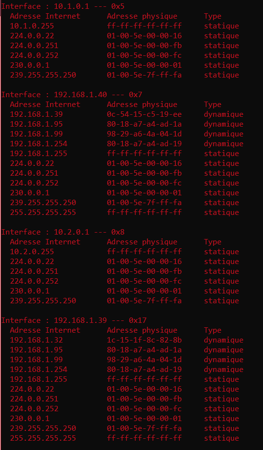

# TP4 Spéléologie réseau : descente dans les couches

## I. Mise en place du lab
### 1. Création des réseaux

Je créer 2 réseaux host-only.

### 2. Création des VMs

Je créer les 3 clones du patron en ajoutant les cartes réseaux créees précedement.

J'effectue ensuite la Checklist.
J'ai modifié les noms des domaines.
Mon client et mon serveur peuvent ping mon routeur 

### 3.Mise en place du routage statique

Je vais maintenant permettre au serveur et au client de se ping entre eux en transformant la machine en routeur `sudo systemctl -w net.ipv4.conf.all.forwarding=1` et désactiver le firewall `sudo sysemctl disable firewalld`.

Je crée les routes entre net1 et net2 pour qu'ils puissent se ping. 
Mission accomplie!!

## II. Spéléologie réseau :
### 1. ARP :

#### A. Manip 1
##### 1 : 
Pour vider la table ARP, j'utilise la commande suivante :
```bash
sudo ip neigh flush all
```

##### 2 :
Pour afficher la table ARP, j'utilise la commande suivante :
```bash
ip neigh show
```

On obtiendra :
```bash
10.1.0.1 dev enp0s3 lladdr 0a:00:27:00:00:11 DELAY
```
C'est la connexion entre putty et mon oridinateur.

##### 3 : 
J'effectue la commande pour afficher la table ARP vue ci-dessus.
```bash
10.2.0.1 dev enp0s3 lladdr 0a:00:27:00:00:12 DELAY
```
C'est la connexion entre putty et mon oridinateur.

##### 4 :
J'effectue la commande : 
```bash
ping server
```

J'effectue la commande pour afficher la table ARP vue ci-dessus.
```bash
10.1.0.254 dev enp0s3 lladdr 08:00:27:16:c7:61 REACHABLE
10.1.0.1 dev enp0s3 lladdr 0a:00:27:00:00:11 REACHABLE
```

1ère ligne : C'est la connexion entre mon client et mon routeur.
2ème ligne : C'est la connexion entre putty et mon oridinateur.

##### 5 :
J'effectue la commande pour afficher la table ARP vue ci-dessus.
```bash 
10.2.0.1 dev enp0s3 lladdr 0a:00:27:00:00:12 DELAY
10.2.0.254 dev enp0s3 lladdr 08:00:27:1a:55:e9 STALE
```

1ère ligne : C'est la connexion entre putty et mon oridinateur.
2ème ligne : C'est la connexion entre mon client et mon routeur.

#### B. Manip 2
##### 1.
Pour vider la table ARP, j'utilise la commande suivante :
``` bash
sudo ip neigh flush all
```

##### 2.
Pour afficher la table ARP, j'utilise la commande suivante :

```bash
ip neigh show
```
J'obtiens cela : 

```bash
10.1.0.1 dev enp0s3 lladdr 0a:00:27:00:00:12 DELAY
```

##### 3.

J'effectue la commande : 
```bash
ping server
```

Les machines communiquent entre elles.

##### 4.
J'effectue la commande vue ci-dessus pour afficher la table ARP.


#### C. Manip 3
##### 1.
Pour vider la table ARP sur mon PC, j'utilise la commande suivante : 
```bash
arp -d
```

##### 2.
Sur mon PC, j'effectue la commande suivante :
 ```bash
 arp -a
 ```
 
- 

#### D. Manip 4
##### 1.
Pour vider la table ARP, j'utilise la commande suivante :
```bash
sudo ip neigh flush all
```

##### 2.
J'affiche la table ARP de client.
- Pour activer la carte NAT :
    - J'éteind la machine client
    - Dans configurations puis dans réseau, je crée une nouvelle carte en NAT.
    - Je rallume la machine client 
    - J'affiche la table ARP

#### 2. Wireshark

#### A. Interception d'ARP et ping

#### 1. Router

 - Lancement de l'enregistrement du trafic avec Wireshark, trafic a enregistrer dans un fichier ping.pcap:
     ```bash
     sudo tcpdump -i enp0s9 -w ping.pcap
     ```

#### 2. Client
- Vider la table ARP: sudo ip neigh flush all
- Envoi des 4 pings au server

#### 3. Router

- Quitter la capture (CTRL + C)
- Je verifie que le fichier ping.pcap soit bien present avec la commande ls 
- Envoi du fichier ping.pcap sur l'hôte


#### B. Interception d'une communication `netcat`
